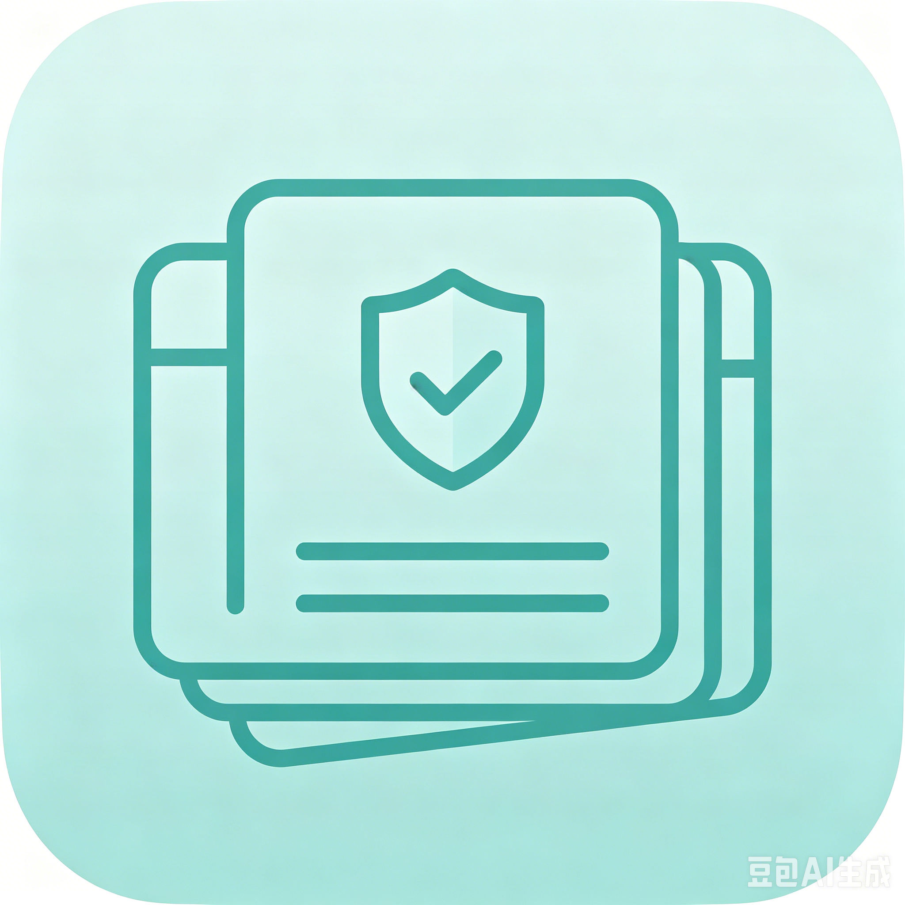

# 001.Information-Safe
## Information Safe - 信息保险箱

<div align="center">



**个人信息安全保险箱** | Android + Windows 双端支持

[](https://flutter.dev/)
[](https://dart.dev/)
[](https://www.sqlite.org/)
[]()
[](https://github.com/peq775287952-gary/001.Information-Safe)

</div>

---

## 📖 项目简介

Information Safe 是一个现代化的个人信息保险箱应用，专为安全存储和管理用户的密码、银行卡、证件及敏感笔记而设计。采用端到端加密技术，确保您的个人数据安全无虞。

### 🎯 核心特性

- 🔐 **军用级加密**: AES-256-GCM + PBKDF2 密钥派生
- 🚀 **双端支持**: Flutter 一套代码，Android + Windows 双端运行
- 🎨 **现代UI**: Material Design 3 + 自定义设计系统
- 🏦 **品牌图标**: 16 家 AI 供应商 + 8 家银行真实 Logo 自动识别
- 🗂️ **智能分类**: 自动识别平台分类，支持自定义文件夹
- 🔍 **快速搜索**: 实时搜索，多字段匹配
- 📸 **附件管理**: 支持照片加密存储
- ⚡ **自动锁定**: 可开关的后台超时自动锁定，防止数据泄露
- 🤖 **API Key 管理**: 专门的大模型 API Key 存储类型
- 🔄 **修改密码**: 随时更换主密码，自动重加密全部数据

---

## 🏗️ 技术架构

### 技术栈

```yaml
前端框架: Flutter 3.38.6
编程语言: Dart 3.10.7
状态管理: Provider
本地存储: SQLite + Flutter Secure Storage
加密引擎: encrypt + crypto
SVG 渲染: flutter_svg
图片处理: image_picker
国际化: flutter_localizations
```

### 核心服务架构

```
┌─────────────────┐    ┌─────────────────┐    ┌─────────────────┐
│   AuthService   │    │  EncryptionService│    │ DatabaseService  │
│   - 主密码管理   │    │  - AES-256-GCM  │    │  - SQLite 数据库 │
│   - 锁定状态     │    │  - PBKDF2 密钥   │    │  - 数据加密存储  │
│   - 失败锁定     │    │  - 安全存储     │    │  - 索引优化     │
└─────────────────┘    └─────────────────┘    └─────────────────┘
         │                       │                       │
         └───────────────────────┼───────────────────────┘
                                 │
                    ┌─────────────────┐
                    │  VaultService  │
                    │  - 数据管理     │
                    │  - 文件夹操作   │
                    │  - 搜索功能     │
                    └─────────────────┘
```

---

## 🚀 快速开始

### 环境要求

- Flutter SDK 3.7.0+
- Android Studio / VS Code
- Android SDK (Android开发)
- Windows SDK (Windows开发)

### 安装步骤

1. **克隆项目**
   ```bash
   git clone https://github.com/peq775287952-gary/001.Information-Safe.git
   cd infovault
   ```

2. **安装依赖**
   ```bash
   flutter pub get
   ```

3. **配置图标** (可选)
   ```bash
   flutter pub run flutter_launcher_icons:main
   ```

4. **构建应用**
   ```bash
   # Android
   flutter build apk --release
   
   # Windows
   flutter build windows --release
   ```

5. **运行应用**
   ```bash
   # Android
   flutter run
   
   # Windows
   flutter run -d windows
   ```

---

## 💡 使用指南

### 首次使用

1. **创建主密码**
   - 首次打开应用时需要设置主密码
   - 建议使用强密码（12位以上，包含大小写字母、数字、特殊字符）
   - 主密码忘记后无法恢复，请务必牢记

### 主要功能

#### 📋 信息管理

支持五种信息类型：

| 类型 | 字段 | 照片支持 |
|------|------|----------|
| 🔑 **登录密码** | 平台名、用户名、密码、邮箱、手机号、网址、备注 | ❌ |
| 💳 **银行卡** | 银行名称、卡号、持卡人、有效期、CVV、取款密码、备注 | ✅ (最多3张) |
| 🪪 **证件** | 证件类型、证件号、姓名、签发机关、有效期、备注 | ✅ (最多3张) |
| 📝 **安全笔记** | 标题、自由文本 | ❌ |
| 🤖 **API Key** | 供应商、API Key、接口地址、模型名称、备注 | ❌ |

#### 🔍 搜索功能

- **实时搜索**: 主界面顶部搜索栏实时筛选
- **多字段搜索**: 支持搜索平台名、用户名、邮箱、手机号、卡号、证件号、备注
- **搜索页面**: 独立的全屏搜索界面，结果按类型分组

#### 🗂️ 文件夹管理

- **智能分类**: 根据平台名或网址自动推荐分类
- **自定义文件夹**: 创建个性化文件夹组织信息
- **灵活筛选**: 按文件夹快速筛选查看

#### 🔒 安全设置

- **自动锁定**: 用户可自行开关，后台超时自动锁定（默认 3 分钟，可自定义）
- **失败锁定**: 连续错误多次后临时锁定
- **剪贴板保护**: 复制后60秒自动清空

---

## 🔐 安全原理

### 加密机制

```
用户输入主密码
    ↓
PBKDF2-HMAC-SHA256 (100,000+ 次迭代)
    ↓
生成 256-bit 加密密钥
    ↓
AES-256-GCM 加密数据
    ↓
存储到本地 SQLite 数据库
```

### 安全特性

1. **密钥派生**: 使用 PBKDF2 算法进行100,000+次迭代，防止暴力破解
2. **随机盐值**: 每个用户使用唯一的随机盐值
3. **AES-256-GCM**: 业界最安全的加密算法之一
4. **内存安全**: 加密密钥仅在内存中存在，不落盘存储

### 数据保护

- **端到端加密**: 数据在设备端完成加密，服务器无法获取明文
- **本地存储**: 所有数据仅存储在用户设备上
- **自动清理**: 复制内容自动清理，防止泄露
- **锁定保护**: 应用锁定时数据完全不可访问

---

## 📱 界面预览

### 主要界面

1. **主界面** (`VaultScreen`)
   - 搜索栏 + 类型筛选 + 文件夹筛选
   - 信息列表展示
   - 底部导航栏

2. **搜索界面** (`SearchScreen`)
   - 全屏搜索
   - 结果分组显示
   - 实时搜索反馈

3. **设置界面** (`SettingsScreen`)
   - 安全设置
   - 文件夹管理
   - 导入导出
   - 关于信息

### 特色设计

- **自适应主题**: 自动跟随系统浅色/深色模式
- **边缘到边缘**: Android 全面屏导航栏自适应，小白条跟随 App 主题
- **品牌图标**: 37 个 SVG 品牌图标，AI + 银行 + 证件全覆盖，支持动态着色
- **响应式布局**: 适配不同屏幕尺寸
- **流畅动画**: 页面转场和交互动画

---

## 🛠️ 开发指南

### 测试

项目包含 **142 个测试** (0 failures)，分三层：
- 单元测试 + Widget 测试 + Golden 截图测试

详见 [TESTING.md](infovault/TESTING.md) 获取完整测试文档和快速命令。

### 项目结构

```
infovault/
├── lib/
│   ├── models/          # 数据模型 (vault_item, item_type, folder)
│   ├── screens/         # 页面 (vault, search, settings, lock, create_password, add_edit_item)
│   ├── services/        # 核心服务 (auth, encryption, database, vault, photo, export_import)
│   ├── widgets/         # 可复用组件 (platform_icon, quick_fill_chips, type_filter_bar 等)
│   ├── theme/           # 主题配置 (app_theme)
│   ├── utils/           # 工具 (brand_icons, constants, validators)
│   └── app.dart         # 应用入口
├── scripts/             # 构建脚本 (bump_version, download_brand_icons)
├── assets/icons/        # SVG 品牌图标 (37 个)
├── test/                # 测试 (138 个)
├── android/             # Android 原生配置
├── pubspec.yaml
└── CHANGELOG.md
```

### 核心服务说明

#### AuthService (认证服务)
- 管理主密码验证
- 处理解锁状态和锁定逻辑
- 控制访问权限

#### EncryptionService (加密服务)
- 提供加密/解密功能
- 密钥派生和管理
- 安全存储密钥

#### DatabaseService (数据库服务)
- SQLite 数据库操作
- 数据持久化
- 查询和索引优化

#### VaultService (保险箱服务)
- 数据业务逻辑
- 文件夹管理
- 搜索功能

---

## 📊 版本信息

### 当前版本: v1.1.3

#### 版本历程

| 版本 | 主要更新 |
|------|----------|
| v1.1.3 | 修改主密码功能、密码最短位数 8→4、重加密机制 |
| v1.1.2 | 导航栏全局适配、银行 SVG 图标修复、永久开发规则 |
| v1.1.1 | AI API Key 类型、SVG 品牌图标系统、自动锁定开关、代码大清理 |
| v1.1.0 | 版本号系统、一键构建脚本 |
| v1.0.5 | UI 重设计，深色模式优化 |
| v1.0.4 | 应用品牌化，图标映射，作者署名 |

### 开发路线

| 阶段 | 状态 | 目标 |
|------|------|------|
| Phase 1: Android 本地版 | ✅ 完成 | 手机端完整可用 |
| Phase 2: Windows 桌面版 | 🚧 进行中 | 电脑端完整可用 |
| Phase 3: 双端扫码同步 | 📋 待规划 | 二维码加密传输 |
| Phase 4: 云端加密储存 | 📋 待规划 | 多设备自动同步 |

---

## 🤝 贡献指南

我们欢迎社区贡献！请遵循以下步骤：

1. **Fork 项目**
2. **创建功能分支** (`git checkout -b feature/AmazingFeature`)
3. **提交更改** (`git commit -m 'Add some AmazingFeature'`)
4. **推送分支** (`git push origin feature/AmazingFeature`)
5. **创建 Pull Request**

### 开发规范

- 遵循 Dart/Flutter 官方代码规范
- 编写单元测试
- 更新相关文档
- 确保 `flutter analyze` 通过

---

## 📄 许可证

本项目采用 MIT 许可证 - 查看 [LICENSE](LICENSE) 文件了解详情。

---

## 🙏 致谢

- [Flutter](https://flutter.dev/) - 跨平台UI框架
- [SQLite](https://www.sqlite.org/) - 轻量级数据库
- [encrypt](https://pub.dev/packages/encrypt) - 加密库
- [Material Design](https://m3.material.io/) - 设计语言

---

## 📞 联系方式

- **作者**: Gary seven
- **邮箱**: peq775287952@163.com
- **GitHub**: [peq775287952-gary](https://github.com/peq775287952-gary)
- **项目地址**: [https://github.com/peq775287952-gary/001.Information-Safe](https://github.com/peq775287952-gary/001.Information-Safe)

---

<div align="center">

**⭐ 如果这个项目对您有帮助，请考虑给我们一个 Star！**

</div>